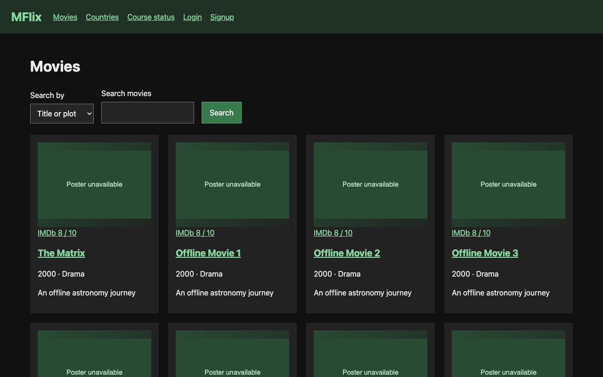
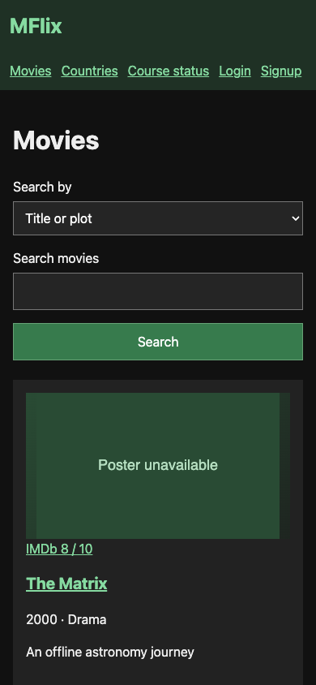

# MFlix — local movie browser

A movie browsing and review application inspired by the MongoDB MFlix course. An Angular frontend connects to an Express API and a local MongoDB database for search, movie details, accounts, comments, and course exercises.

## What you can do

- Search by text, genre, cast, country, and facets; browse paginated results.
- Open movie details and related searches.
- Sign up, log in, and save account preferences.
- Create, edit, and delete comments you own.
- Access admin reports and run the original course validator controls.

## Preview



Captured from the running application on September 30, 2026. Any sample records shown are demonstration or isolated test data, not data included with a fresh installation.

<details>
<summary>Mobile view</summary>



</details>

## Run locally

Prerequisites: the Node version in `.nvmrc` (currently 26.10.0), npm, and MongoDB Community 9.0.2. From the repository root:

```sh
npm ci
npm run setup:local
npm --prefix frontend ci
npm --prefix frontend run build
```

Start MongoDB in a foreground terminal:

```sh
mkdir -p .local/mongodb
mongod --dbpath .local/mongodb --bind_ip 127.0.0.1 --port 27018 --replSet offline-rs
```

If that local replica set already runs on port 27018, reuse it rather than starting a second instance. In another terminal at the repository root:

```sh
npm run db:init
npm start
```

Open [http://127.0.0.1:8002](http://127.0.0.1:8002). Keep both processes in the foreground and stop them with **Ctrl+C**. Setup creates a private, ignored `.env.local` without overwriting an existing file. Database initialization creates no application records. These defaults use local MongoDB; no Atlas account is required.

## Bring a movie dataset

No movie dataset is bundled or automatically seeded. A fresh database starts empty; the preview uses temporary test records. The course validators expect the original 23,530-movie sample dataset, so a working app does not imply every course ticket passes. Some validators create or delete exercise records; inspect them before running against valuable data. Posters have an offline fallback; optional videos require connectivity.

## Development

```sh
npm run check
npm test
npm --prefix frontend run typecheck
npm --prefix frontend test -- --browsers=ChromeHeadless
```

Backend tests use an isolated local database. `npm --prefix frontend start` runs the frontend development server and proxies `/api` to port 8002. Express normally serves `frontend/dist/mflix/browser`. Legacy course exercises in `test/` are retained separately from the runnable suite in `tests/`.
